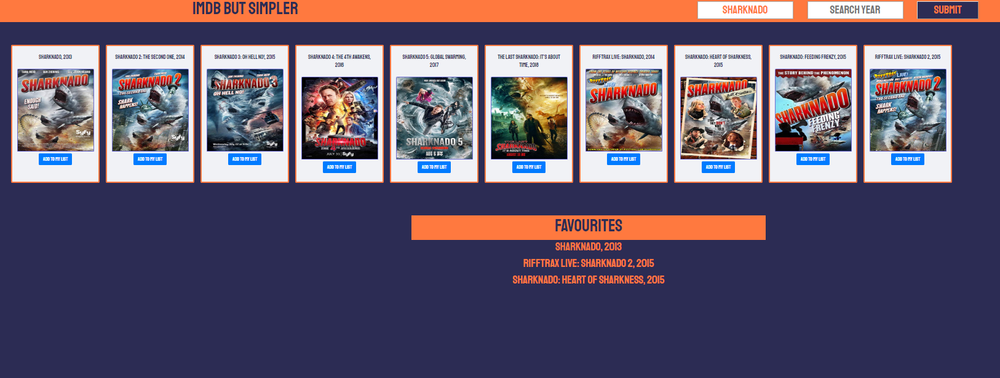

# movie-database
In this project I created an app using Open Movie Datadase API.

I learned to access information from the API using fetch in Typescript and create an interactive user interface for searching movies.

The app includes a list of movies (title, year and poster image). User can use search movie function to search films by a keyword or by a keyword and a specific year. User can add movies to favorites with 'add to favourites' function.

## Installation
Clone down the repo and run yarn install. Build the project by running yarn build. Open html file in browser/live server. 

## Next Steps
Aim of the next refractoring will be to make code drier. At the moment the movie can be added to the favourites list, but the next step would be to store the favourites list to the local storage so it can be accessible by clicking on the 'Show Favourites' button and cleared with 'Empty Favourites' button.

## Screenshot
